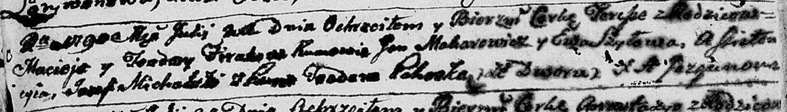

**Фираго Мацей (Firaho Maciey)**

25? июля 1790 г -- крещение дочери Тересы (НИАБ 136-13-894, лист 10об,
№51/1790-р (ориг)).

**НИАБ 136-13-894:** Лист 10об. **Метрическая запись №51/1790-р
(ориг).**

Дедиловичская Покровская церковь. 25? июля 1790 года. Метрическая запись
о крещении.

Firahowna Teresa -- дочь родителей со двора Дедиловичи.

Firaho Maciej -- отец.

Firahowa Teodora -- мать.

Makarewicz Jan - кум.

Szyłowa Ewa - кума.

Michalski Jozef -- ассистент.

Pohoska Teodora, JP -- ассистентка, шляхтянка.

Jazgunowicz Antoni -- ксёндз.
