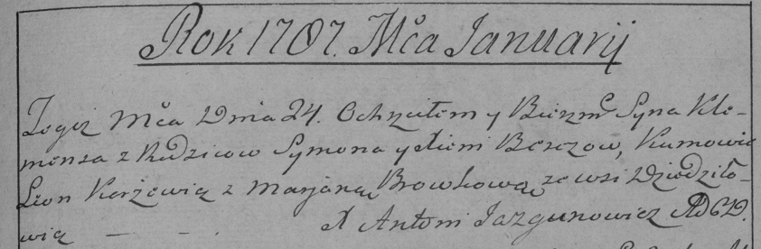

**Б...ч Ксеня (B\...czowa Xienia)**

24 января 1787 г -- крещение сына Клеменса (РГИА 823-2-18, лист 233,
№1/1787-р (коп)).

**РГИА 823-2-18:** Лист 233. **Метрическая запись №1/1787-р (коп).**

Дедиловичская Покровская церковь. 24 января 1787 года. Метрическая
запись о крещении.

B\...cz Klemens -- сын родителей с деревни Дедиловичи.

B\...cz Symon -- отец.

B\...czowa Xienia -- мать.

Karżewicz Leon -- кум.

Browkowa Marjana - кума.

Jazgunowicz Antoni -- ксёндз.
