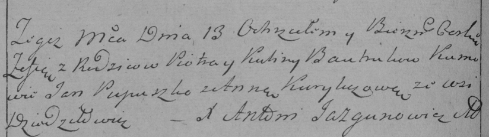

**Бавтрук Пётр (Bautruk Piotr)**

13 октября 1784 г -- крещение дочери Зофии (РГИА 823-2-18, лист 227об,
№21/1784-р (коп)).

**РГИА 823-2-18:** Лист 227об. **Метрическая запись №21/1784-р (коп).**

Дедиловичская Покровская церковь. 13 октября 1784 года. Метрическая
запись о крещении.

Bautrukowna Zofija -- дочь родителей с деревни Дедиловичи.

Bautruk Piotr -- отец.

Bautrukowa Kulina -- мать.

Pupuszko Jan -- кум.

Kuryliczowa Anna - кума.

Jazgunowicz Antoni -- ксёндз.
