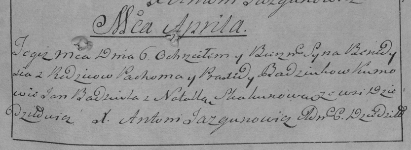

**Бадюля Бенедысь Похомов (Badziula Benedyś)**

6 апреля 1797 г -- крещение (НИАБ 136-13-894, лист 32об, №18/1797-р
(ориг)), (РГИА 823-2-18, лист 259, №16/1797-р (коп)).

**НИАБ 136-13-894:** Лист 32об. **Метрическая запись №18/1797-р
(ориг).**

{width="6.496527777777778in"
height="1.375877077865267in"}

Дедиловичская Покровская церковь. 6 апреля 1797 года. Метрическая запись
о крещении.

Badziula Benedyś -- сын родителей с деревни Дедиловичи.

Badziula Pochom -- отец.

Badziulewa Parakxeda -- мать.

Badziula Jan - кум.

Skakunowa Natalla -- кума.

Stralczonek Mikołay -- ассистент.

Palitykowa Agata - ассистентка.

Jazgunowicz Antoni -- ксёндз.

**РГИА 823-2-18:** Лист 259. **Метрическая запись №16/1797-р (коп).**

{width="6.496527777777778in"
height="2.370833333333333in"}

Дедиловичская Покровская церковь. 6 апреля 1797 года. Метрическая запись
о крещении.

Badziula Benedyś -- сын родителей с деревни Дедиловичи.

Badziula Pachom -- отец.

Badziulowa Praxeda -- мать.

Badziula Jan -- кум.

Skakunowa Natalla -- кума.

Jazgunowicz Antoni -- ксёндз.
