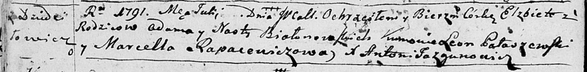

**Белановская Наста (Biołonowska Nasta)**

? июля 1791 г -- крещение дочери Елисаветы (НИАБ 136-13-894, лист 13об,
№33/1791-р (ориг)).

**НИАБ 136-13-894:** Лист 13об. **Метрическая запись №33/1791-р
(ориг).**

Дедиловичская Покровская церковь. ? июля 1791 года. Метрическая запись о
крещении.

Biołonowska Elżbieta -- дочь родителей с деревни Дедиловичи.

Biołonowski Adam -- отец.

Biołonowska Nasta -- мать.

Pałaszewski Leon - кум.

Rapacewiczowa Marcella - кума.

Jazgunowicz Antoni -- ксёндз.
