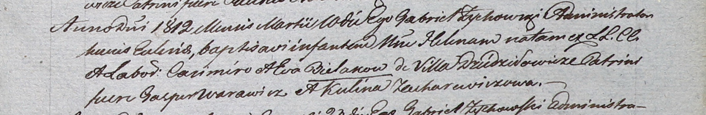

**Беляк Ева (Bielakowa Eva)**

10 марта 1812 г -- крещение дочери Елены (НИАБ 937-4-32, лист 24,
№4/1812-р).

**НИАБ 937-4-32:** Лист 24. **Метрическая запись №4/1812-р.**

Дедиловичский костел Наисвятейшего Сердца Иисуса. 10 марта 1812 года.
Метрическая запись о крещении.

Bielakowna Helena -- дочь крестьян с деревни Дедиловичи.

Bielak Casimir -- отец.

Bielakowa Eva -- мать.

Warawicz Gasper -- крестный отец.

Zacharewiczowa Kulina -- крестная мать.

Zychowski Gabriel -- ксёндз.
