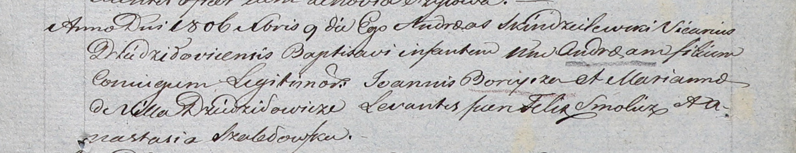

**Борейша Андрей Янов (Boreyrza Andreas)**

9 декабря 1806 г -- крещение (НИАБ 937-4-32, лист 14, №25/1806-р).

**НИАБ 937-4-32:** Лист 14. **Метрическая запись №25/1806-р.**

Дедиловичский костел Наисвятейшего Сердца Иисуса. 9 декабря 1806 года.
Метрическая запись о крещении.

Boreyrza Andreas -- сын родителей с деревни Дедиловичи.

Boreyrza Joannis -- отец.

Boreyrzowa Marianna -- мать.

Smolicz Felix -- крестный отец.

Szabłowska Anastasia -- крестная мать.

Skindzelewski Andreas -- ксёндз, викарий Дедиловичский.
