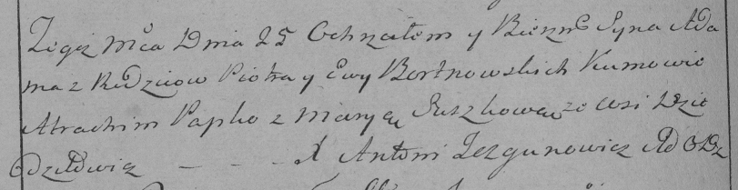

**Бортновский Адам Петров (Bortnowski Adam)**

25 декабря 1795 г -- крещение (НИАБ 136-13-894, лист 27, №66/1795-р
(ориг)), (РГИА 823-2-18, лист 254об, №49/1795-р (коп)).

**НИАБ 136-13-894:** Лист 27. **Метрическая запись №66/1795-р (ориг).**

{width="6.496527777777778in"
height="1.335647419072616in"}

Дедиловичская Покровская церковь. 25 декабря 1795 года. Метрическая
запись о крещении.

Bortnowski Adam -- сын родителей с деревни Дедиловичи.

Bortnowski Piotr -- отец.

Bortnowska Ewa -- мать.

Papko Atrachim - кум.

Suszkowa Maryia - кума.

Jazgunowicz Antoni -- ксёндз.

Лист 254об. **Метрическая запись №49/1795-р (коп).**

{width="6.496527777777778in"
height="1.6743055555555555in"}

Дедиловичская Покровская церковь. 25 декабря 1795 года. Метрическая
запись о крещении.

Bortnowski Adam -- сын родителей с деревни Дедиловичи.

Bortnowski Piotr -- отец.

Bortnowska Ewa -- мать.

Papko Atrachim -- кум.

Suszkowa Marya -- кума.

Jazgunowicz Antoni -- ксёндз.
