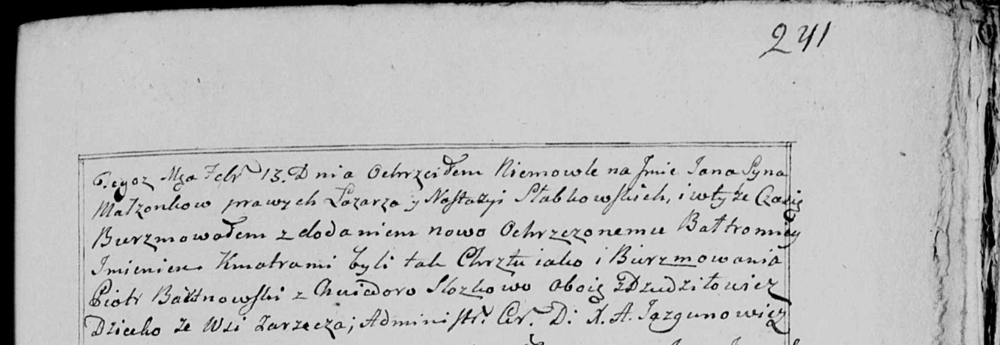

**Бортновский Пётр (Bortnowski Piotr)**

25 декабря 1795 г -- крещение сына Адама (НИАБ 136-13-894, лист 27,
№66/1795-р (ориг)), (РГИА 823-2-18, лист 254об, №49/1795-р (коп)).

13 февраля 1799 г -- крестный отец Яна Балтромея, сына Слабковского
Лазаря и Настасьи с деревни Заречье (НИАБ 136-13-938, лист 241,
№10/1799-р (коп)).

7 октября 1800 г -- крестный отец Луки Яна, сына Авдюховичей Хомы и
Марьяны с деревни Замосточье (НИАБ 136-13-949, лист 103об, №31/1800-р
(коп)).

3 августа 1802 г -- крещение сына Каетана (НИАБ 937-4-32, лист 7,
№21/1802-р).

**НИАБ 136-13-894:** Лист 27. **Метрическая запись №66/1795-р (ориг).**

{width="6.496527777777778in"
height="1.335647419072616in"}

Дедиловичская Покровская церковь. 25 декабря 1795 года. Метрическая
запись о крещении.

Bortnowski Adam -- сын родителей с деревни Дедиловичи.

Bortnowski Piotr -- отец.

Bortnowska Ewa -- мать.

Papko Atrachim - кум.

Suszkowa Maryia - кума.

Jazgunowicz Antoni -- ксёндз.

Лист 254об. **Метрическая запись №49/1795-р (коп).**

{width="6.496527777777778in"
height="1.6743055555555555in"}

Дедиловичская Покровская церковь. 25 декабря 1795 года. Метрическая
запись о крещении.

Bortnowski Adam -- сын родителей с деревни Дедиловичи.

Bortnowski Piotr -- отец.

Bortnowska Ewa -- мать.

Papko Atrachim -- кум.

Suszkowa Marya -- кума.

Jazgunowicz Antoni -- ксёндз.

**НИАБ 136-13-938:** Лист 241. **Метрическая запись №10/1799-р (коп).**

(См. тж. НИАБ 136-13-894, лист 38об, №10/1799-р (ориг); РГИА 823-2-18,
лист 268об, №10/1799-р (коп))

{width="6.496527777777778in"
height="2.245138888888889in"}

Дедиловичская Покровская церковь. 13 февраля 1799 года. Метрическая
запись о крещении.

Słabkowski Jan Bałtromiey -- сын родителей с деревни Заречье.

Słabkowski Łazarz -- отец.

Słabkowska Nastazya -- мать.

Bartnowski Piotr -- кум, с деревни Дедиловичи.

Slozkowa Chwiedora - кума, с деревни Дедиловичи.

Jazgunowicz Antoni -- ксёндз.

**НИАБ 136-13-949:** Лист 103об. **Метрическая запись №31/1800-р
(коп).**

(См. тж.: НИАБ 136-13-894, лист 42, №28/1800-р (ориг))

{width="6.496527777777778in"
height="1.1416666666666666in"}

Дедиловичская Покровская церковь. 7 октября 1800 года. Метрическая
запись о крещении.

Audziuchowicz Łukasz Jan -- сын родителей с деревни \[Замосточье\].

Audziuchowicz Tomasz -- отец.

Audziuchowiczowa Marjana -- мать.

Bortnowski Piotr -- кум, с деревни Дедиловичи.

Zielonkowa Anna - кума, с деревни Замосточье.

Jazgunowicz Antoni -- ксёндз.

**НИАБ 937-4-33:** Лист 7. **Метрическая запись №21/1802-р.**

{width="6.496527777777778in"
height="0.9875in"}

Дедиловичский костел Наисвятейшего Сердца Иисуса. 3 августа 1802 года.
Метрическая запись о крещении.

Bartnowski Caetan -- сын вольных людей с деревни Дедиловичи.

Bartnowski Petrus -- отец.

Bartnowska Eva -- мать.

Popko Atrachim -- крестный отец, крестьянин, с деревни Дедиловичи.

Kuryłowa Mariana -- крестная мать, крестьянка, с деревни Дедиловичи.

Linhart Hyacinthus -- ксёндз.
