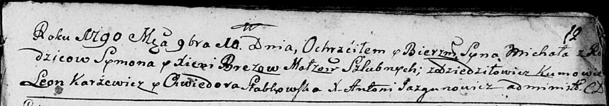
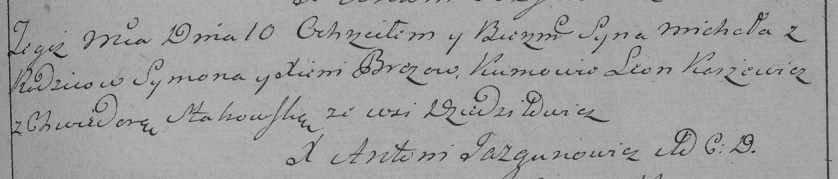

**Брез Михал Сымонов (Brez Michał)**

9 ноября 1790 г -- крещение (НИАБ 136-13-894, лист 12, №82/1790-р
(ориг)), (РГИА 823-2-18, лист 241, №31/1790-р (коп)).

**НИАБ 136-13-894:** Лист 12. **Метрическая запись №82/1790-р (ориг).**

Дедиловичская Покровская церковь. 9 ноября 1790 года. Метрическая запись
о крещении.

Brez Michał -- сын родителей с деревни Дедиловичи.

Brez Symon -- отец.

Brezowa Xienia -- мать.

Karżewicz Leon - кум.

Słabkowska Chwiedora - кума.

Jazgunowicz Antoni -- ксёндз.

**РГИА 823-2-18:** Лист 241. **Метрическая запись №31/1790-р (коп).**

Дедиловичская Покровская церковь. 10 ноября 1790 года. Метрическая
запись о крещении.

Brez Michał -- сын родителей с деревни Дедиловичи.

Brez Symon -- отец.

Brezowa Xienia -- мать.

Karżewicz Leon -- кум.

Stahowska Chwiedora - кума.

Jazgunowicz Antoni -- ксёндз.
