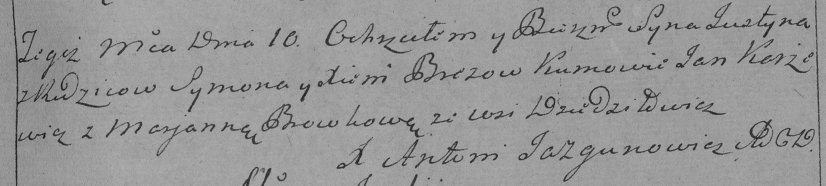

**Брез Юстын (Brez Justyn)**

10 июня 1789 г -- крещение (НИАБ 136-13-894, лист 7, №32/1789-р (ориг)),
(РГИА 823-2-18, лист 238, №13/1789-р (коп)).

**НИАБ 136-13-894:** Лист 7. **Метрическая запись №32/1789-р (ориг).**

{width="6.496527777777778in"
height="0.8984776902887139in"}

Дедиловичская Покровская церковь. 10 июня 1789 года. Метрическая запись
о крещении.

Brez Justyn -- сын родителей с деревни Дедиловичи.

Brez Symon -- отец.

Brezowa Xienia -- мать.

Karżewicz Jan - кум.

Browkowa Marjana - кума.

Jazgunowicz Antoni -- ксёндз.

**РГИА 823-2-18:** Лист 238. **Метрическая запись №13/1789-р (коп).**

{width="6.496527777777778in"
height="1.4631944444444445in"}

Дедиловичская Покровская церковь. 10 июня 1789 года. Метрическая запись
о крещении.

Brez Justyn -- сын родителей с деревни Дедиловичи.

Brez Symon -- отец.

Brezowa Xienia -- мать.

Karżewicz Jan -- кум.

Browkowa Marjanna - кума.

Jazgunowicz Antoni -- ксёндз.
