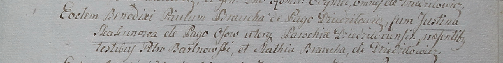

**Бровка Матей (Broucha Matias)**

22 сентября 1799 г -- свидетель венчания Павла Бровки с деревни
Дедиловичи с Юстиной Скакун с деревни Осово (НИАБ 1781-27-199, лист 130,
№8/1799-б).

**НИАБ 1781-27-199:** Лист 130. **Метрическая запись №8/1799-б.**

Дедиловичский костел Наисвятейшего Сердца Иисуса. 22 сентября 1799 года.
Метрическая запись о венчании.

Broucha Paul -- жених, с деревни Дедиловичи.

Skakunowa Justina -- невеста, с деревни Осово, парохии Дедиловичской.

Bartnowski Petro -- свидетель.

Broucha Matias -- свидетель, с деревни Дедиловичи.

Linhart Hyacinthus -- ксёндз.
