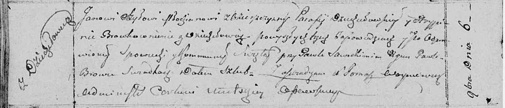

**Коренько (Бровко) Вера (Karańkowa (Browkowna) Wiera)**

31 января 1798 г -- венчание с Верой Бровко с деревни Дедиловичи (НИАБ
136-13-920, лист 5об, №6/1798-б (ориг)).

**НИАБ 136-13-920:** Лист 5об. **Метрическая запись №6/1798-б (ориг).**

{width="6.496527777777778in"
height="1.7721456692913387in"}

Дедиловичская Покровская церковь. 31 января 1798 года. Метрическая
запись о венчании.

Karańko Wasil -- жених, деревня Пядынь.

Browkowna Wiera -- невеста, деревня Дедиловичи.

Rozynka Marcin -- свидетель.

Makowski Jerzy -- свидетель.

Jazgunowicz Antoni -- ксёндз.
