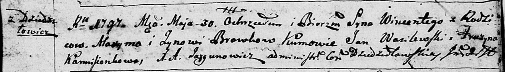
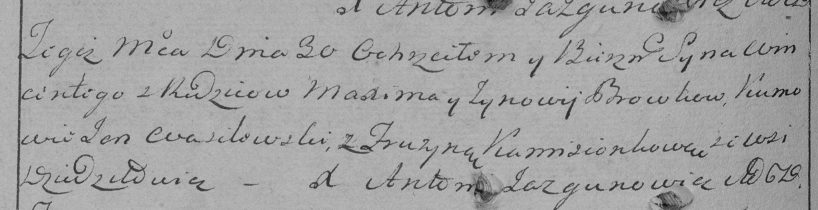

**Бровка Винценты Максымов (Browka Wincenty)**

30 мая 1797 г -- крещение (НИАБ 136-13-894, лист 33, №32/1797-р (ориг)),
(РГИА 823-2-18, лист 259об, №23/1797-р (коп)).

**НИАБ 136-13-894:** Лист 33. **Метрическая запись №32/1797-р (ориг).**

Дедиловичская Покровская церковь. 30 мая 1797 года. Метрическая запись о
крещении.

Browka Wincenty -- сын родителей с деревни Дедиловичи.

Browka Maxym -- отец.

Browkowa Zynowia -- мать.

Wasilewski Jan - кум.

Kamisionkowa Pruzyna - кума.

Jazgunowicz Antoni -- ксёндз.

**РГИА 823-2-18:** Лист 259об. **Метрическая запись №23/1797-р (коп).**

Дедиловичская Покровская церковь. 30 мая 1797 года. Метрическая запись о
крещении.

Browko Wincenty -- сын родителей с деревни Дедиловичи.

Browko Maxym -- отец.

Browkowa Zynowija -- мать.

Wasilewski Jan -- кум.

Kamisionkowa Fruzyna -- кума.

Jazgunowicz Antoni -- ксёндз.
