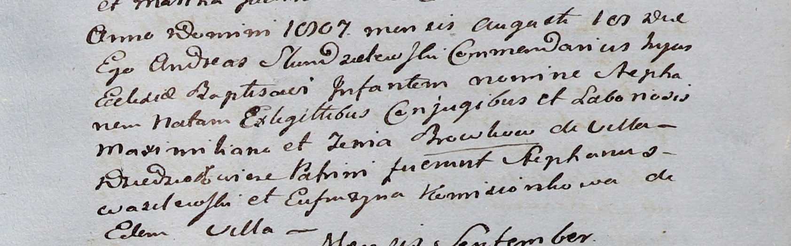

**Бровка Иоанн Максымов (Browka Joann)**

26 мая 1812 г -- крещение (НИАБ 937-4-32, лист 24, №6/1812-р).

**НИАБ 937-4-32:** Лист 24. **Метрическая запись №6/1812-р.**

{width="6.496527777777778in"
height="0.9777777777777777in"}

Дедиловичский костел Наисвятейшего Сердца Иисуса. 26 мая 1812 года.
Метрическая запись о крещении.

Browka Joann -- сын крестьян с деревни Дедиловичи.

Browka Maximilian -- отец.

Browkowa Zenia -- мать.

Wasilewski Stephan -- крестный отец.

Komisionkowa Eufrosina -- крестная мать.

Zychowski Gabriel -- ксёндз.
