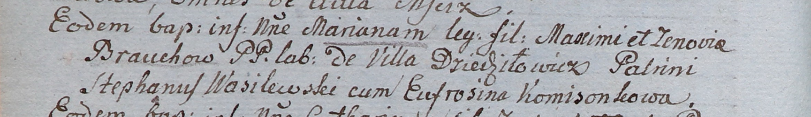

**Бровка Марьяна Максымова (Brouchowa Mariana)**

26 марта 1805 г -- крещение (НИАБ 937-4-32, лист 11об, №14/1805-р).

**НИАБ 937-4-32:** Лист 11об. **Метрическая запись №14/1805-р.**

Дедиловичский костел Наисвятейшего Сердца Иисуса. 26 марта 1805 года.
Метрическая запись о крещении.

Brouchowa Mariana -- дочь крестьян с деревни Дедиловичи.

Broucha Maxim -- отец.

Brouchowa Zenovia -- мать.

Wasilewski Stephan -- крестный отец.

Komisonkowa Eufrosina -- крестная мать.

Linhart Hiacinthus -- ксёндз.
