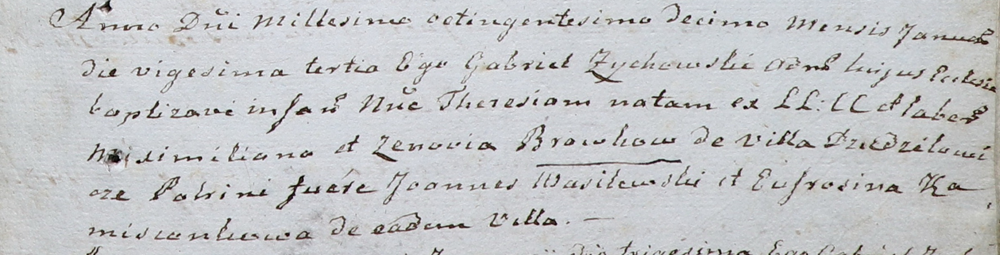

**Бровка Терезия Максымова (Browkowna Theresia)**

23 января 1810 г -- крещение дочери Терезии (НИАБ 937-4-32, лист 21,
№5/1810-р).

**НИАБ 937-4-32:** Лист 21. **Метрическая запись №5/1810-р.**

Дедиловичский костел Наисвятейшего Сердца Иисуса. 23 января 1810 года.
Метрическая запись о крещении.

Browkowna Theresia -- дочь крестьян с деревни Дедиловичи.

Browka Maximilian -- отец.

Browkowa Zenovia -- мать.

Wasilewski Joann -- крестный отец.

Kamisionkowa Eufrosina -- крестная мать, с деревни Дедиловичи.

Zychowski Gabriel -- ксёндз.
