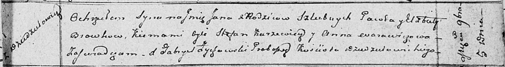

**Бровка Павел (Browka Paweł)**

5 ноября 1811 г -- крещение сына Яна (НИАБ 136-13-894, лист 82,
№55/1811-р (ориг)).

**НИАБ 136-13-894:** Лист 82. **Метрическая запись №55/1811-р (ориг).**

Осовская Покровская церковь. 5 ноября 1811 года. Метрическая запись о
крещении.

Browko Jan -- сын родителей с деревни Дедиловичи.

Browko Pawel -- отец.

Browkowa Elżbieta -- мать.

Karżewicz Stefan -- кум.

Warawiczowa Anna -- кума.

Woyniewicz Tomasz -- ксёндз.
