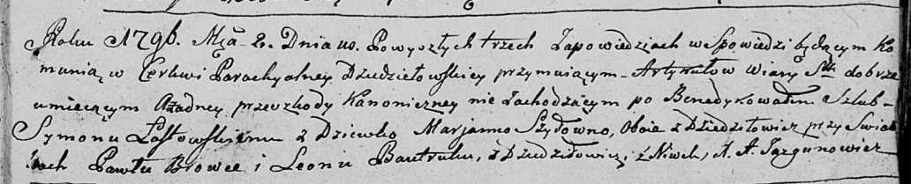

**Бровка Андрей Павлов (Browka Andrzey Piotr)**

18 сентября 1795 г -- крещение сына Андрея Петра (НИАБ 136-13-894, лист
25об, №36/1795-р (ориг)), (РГИА 823-2-18, лист 253, №29/1795-р (коп)).

**НИАБ 136-13-894:** Лист 25об. **Метрическая запись №36/1795-р
(ориг).**

{width="6.496527777777778in"
height="1.0754910323709537in"}

Дедиловичская Покровская церковь. 18 сентября 1795 года. Метрическая
запись о крещении.

Browka Andrzey Piotr -- сын родителей с деревни Дедиловичи.

Browka Paweł -- отец

Browkowa Marjana -- мать

Suszko Prokop - кум.

Sawicka Marjana - кума.

Jazgunowicz Antoni -- ксёндз.

**РГИА 823-2-18:** Лист 253. **Метрическая запись №29/1795-р (коп).**

{width="6.496527777777778in"
height="1.2534722222222223in"}

Дедиловичская Покровская церковь. 16 сентября 1795 года. Метрическая
запись о крещении.

Browka Andrzey -- сын родителей с деревни Дедиловичи.

Browka Paweł -- отец.

Browkowa Marjana -- мать.

Suszko Prokop -- кум.

Sawicka Marjana -- кума.

Jazgunowicz Antoni -- ксёндз.
