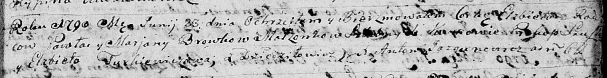
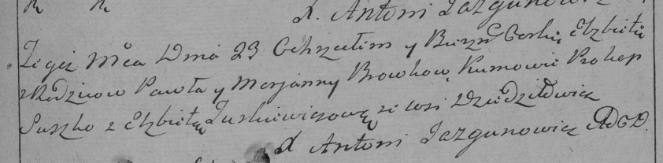

**Бровка Елисавета Павлова (Browkowna Elżbieta)**

23 июня 1790 г -- крещение (НИАБ 136-13-894, лист 10, №36/1790-р
(ориг)), (РГИА 823-2-18, лист 240, №17/1790-р (коп)).

**НИАБ 136-13-894:** Лист 10. **Метрическая запись №36/1790-р (ориг).**

Дедиловичская Покровская церковь. 23 июня 1790 года. Метрическая запись
о крещении.

Browkowna Elżbieta -- дочь родителей с деревни Дедиловичи.

Browka Paweł -- отец.

Browkowa Marjana -- мать.

Szuszko Prokop - кум.

Тurkiewiczowa Elżbieta - кума.

Jazgunowicz Antoni -- ксёндз.

**РГИА 823-2-18:** Лист 240. **Метрическая запись №18/1790-р (коп).**

Дедиловичская Покровская церковь. 23 июня 1790 года. Метрическая запись
о крещении.

Browkowna Elżbieta -- дочь родителей с деревни Дедиловичи.

Browka Paweł -- отец.

Browkowa Marjanna -- мать.

Suszko Prokop -- кум.

Turkiewiczowa Elżbieta - кума.

Jazgunowicz Antoni -- ксёндз.
