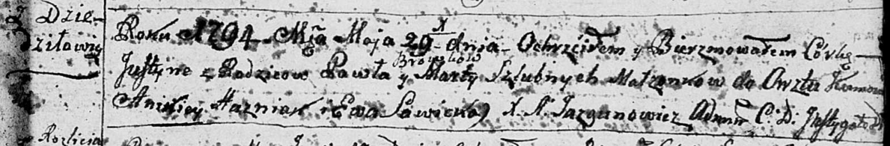

**Бровка Марьяна (Browkowa Marjana, Marta)**

27 февраля 1785 г -- крещение сына Яна (РГИА 823-2-18, лист 228об,
№6/1785-р (коп)).

23 июня 1790 г -- крещение дочери Елисаветы (НИАБ 136-13-894, лист 10,
№36/1790-р (ориг)), (РГИА 823-2-18, лист 240, №17/1790-р (коп)).

9 января 1793 г -- крещение дочери Татьяны (НИАБ 136-13-894, лист 18,
№7/1793-р (ориг)).

29 мая 1794 г -- крещение дочери Юстыны (НИАБ 136-13-894, лист 22,
№23/1794-р (ориг)), (РГИА 823-2-18, лист 249об, №14/1794-р (коп)).

18 сентября 1795 г -- крещение сына Андрея Петра (НИАБ 136-13-894, лист
25об, №36/1795-р (ориг)), (РГИА 823-2-18, лист 253, №29/1795-р (коп)).

22 января 1799 г -- отпевание, умерла в возрасте 45 лет (родилась около
1754 г) (НИАБ 1781-27-199, лист 127, №6/1799-у).

**РГИА 823-2-18:** Лист 228об. **Метрическая запись №6/1785-р (коп).**

Дедиловичская Покровская церковь. 27 февраля 1785 года. Метрическая
запись о крещении.

Browka Jan -- сын родителей с деревни Дедиловичи.

Browka Paweł -- отец.

Browkowa Marjana -- мать.

Suszko Prokop -- кум.

Sawicka Elżbieta - кума.

Jazgunowicz Antoni -- ксёндз.

**НИАБ 136-13-894:** Лист 10. **Метрическая запись №36/1790-р (ориг).**

Дедиловичская Покровская церковь. 23 июня 1790 года. Метрическая запись
о крещении.

Browkowna Elżbieta -- дочь родителей с деревни Дедиловичи.

Browka Paweł -- отец.

Browkowa Marjana -- мать.

Szuszko Prokop - кум.

Тurkiewiczowa Elżbieta - кума.

Jazgunowicz Antoni -- ксёндз.

**РГИА 823-2-18:** Лист 240. **Метрическая запись №18/1790-р (коп).**

Дедиловичская Покровская церковь. 23 июня 1790 года. Метрическая запись
о крещении.

Browkowna Elżbieta -- дочь родителей с деревни Дедиловичи.

Browka Paweł -- отец.

Browkowa Marjanna -- мать.

Suszko Prokop -- кум.

Turkiewiczowa Elżbieta - кума.

Jazgunowicz Antoni -- ксёндз.

**НИАБ 136-13-894:** Лист 18. **Метрическая запись №7/1793-р (ориг).**

Дедиловичская Покровская церковь. 9 января 1793 года. Метрическая запись
о крещении.

Browkowna Taciana -- дочь родителей с деревни Дедиловичи.

Browka Paweł -- отец.

Browka Marjana -- мать.

Suszko Prakop -- кум.

Jurkiewiczowa Elżbieta -- кума.

Jazgunowicz Antoni -- ксёндз.

**НИАБ 136-13-894:** Лист 22. **Метрическая запись №23/1794-р (ориг).**

Дедиловичская Покровская церковь. 29 мая 1794 года. Метрическая запись о
крещении.

Browkowna Justyna -- дочь родителей с деревни Дедиловичи.

Browka Paweł -- отец.

Browkowa Marta -- мать.

Huzniak Anikiey - кум.

Sawicka Ewa - кума.

Jazgunowicz Antoni -- ксёндз.

**РГИА 823-2-18:** Лист 249об. **Метрическая запись №14/1794-р (коп).**

Дедиловичская Покровская церковь. 29 мая 1794 года. Метрическая запись о
крещении.

Browkowna Justyna -- дочь родителей с деревни Дедиловичи.

Browka Paweł -- отец.

Browkowa Marta -- мать.

Huzniak Anikiey -- кум.

Sawicka Ewa -- кума.

Jazgunowicz Antoni -- ксёндз.

**НИАБ 136-13-894:** Лист 25об. **Метрическая запись №36/1795-р
(ориг).**

Дедиловичская Покровская церковь. 18 сентября 1795 года. Метрическая
запись о крещении.

Browka Andrzey Piotr -- сын родителей с деревни Дедиловичи.

Browka Paweł -- отец

Browkowa Marjana -- мать

Suszko Prokop - кум.

Sawicka Marjana - кума.

Jazgunowicz Antoni -- ксёндз.

**РГИА 823-2-18:** Лист 253. **Метрическая запись №29/1795-р (коп).**

Дедиловичская Покровская церковь. 16 сентября 1795 года. Метрическая
запись о крещении.

Browka Andrzey -- сын родителей с деревни Дедиловичи.

Browka Paweł -- отец.

Browkowa Marjana -- мать.

Suszko Prokop -- кум.

Sawicka Marjana -- кума.

Jazgunowicz Antoni -- ксёндз.

**НИАБ 1781-27-199:** Лист 127. **Метрическая запись №6/1799-у.**

Дедиловичский костел Наисвятейшего Сердца Иисуса. 22 января 1799 года.
Метрическая запись об отпевании.

Browhowa Mariana -- умершая, 45 лет, с деревни Дедиловичи.

Linhart Hyacinthus -- ксёндз.
