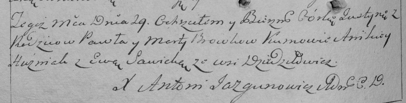

**Бровка Юстына Павлова (Browkowna Justyna)**

29 мая 1794 г -- крещение (НИАБ 136-13-894, лист 22, №23/1794-р (ориг)),
(РГИА 823-2-18, лист 249об, №14/1794-р (коп)).

**НИАБ 136-13-894:** Лист 22. **Метрическая запись №23/1794-р (ориг).**

Дедиловичская Покровская церковь. 29 мая 1794 года. Метрическая запись о
крещении.

Browkowna Justyna -- дочь родителей с деревни Дедиловичи.

Browka Paweł -- отец.

Browkowa Marta -- мать.

Huzniak Anikiey - кум.

Sawicka Ewa - кума.

Jazgunowicz Antoni -- ксёндз.

**РГИА 823-2-18:** Лист 249об. **Метрическая запись №14/1794-р (коп).**

Дедиловичская Покровская церковь. 29 мая 1794 года. Метрическая запись о
крещении.

Browkowna Justyna -- дочь родителей с деревни Дедиловичи.

Browka Paweł -- отец.

Browkowa Marta -- мать.

Huzniak Anikiey -- кум.

Sawicka Ewa -- кума.

Jazgunowicz Antoni -- ксёндз.
