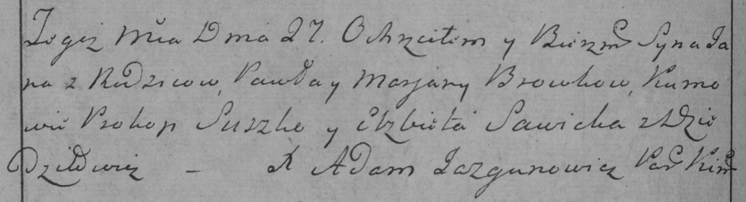

**Бровка Ян Павлов (Browka Jan)**

27 февраля 1785 г -- крещение (РГИА 823-2-18, лист 228об, №6/1785-р
(коп)).

**РГИА 823-2-18:** Лист 228об. **Метрическая запись №6/1785-р (коп).**

Дедиловичская Покровская церковь. 27 февраля 1785 года. Метрическая
запись о крещении.

Browka Jan -- сын родителей с деревни Дедиловичи.

Browka Paweł -- отец.

Browkowa Marjana -- мать.

Suszko Prokop -- кум.

Sawicka Elżbieta - кума.

Jazgunowicz Antoni -- ксёндз.
