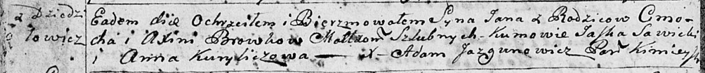

**Бровка Аксинья (Browkowa Axinia)**

28 апреля 1790 г -- крещение дочери Арыны (НИАБ 136-13-894, лист 9об,
№27/1790-р (ориг)), (РГИА 823-2-18, лист 239об, №13/1790-р (коп)).

14 ноября 1792 г -- крещение сына Яна (НИАБ 136-13-894, лист 17об,
№74/1792-р (ориг)).

**НИАБ 136-13-894:** Лист 9об. **Метрическая запись №27/1790-р (ориг).**

{width="6.496527777777778in"
height="1.133824365704287in"}

Дедиловичская Покровская церковь. 28 апреля 1790 года. Метрическая
запись о крещении.

Browkowna Aryna -- дочь родителей с деревни Дедиловичи.

Browka Cimachwiey -- отец.

Browkowa Xienia -- мать.

Sawicki Jan - кум.

Kurylowiczowa Anna - кума.

Jazgunowicz Antoni -- ксёндз.

**РГИА 823-2-18:** Лист 239об. **Метрическая запись №13/1790-р (коп).**

{width="6.496527777777778in"
height="1.7486111111111111in"}

Дедиловичская Покровская церковь. 28 апреля 1790 года. Метрическая
запись о крещении.

Browkowna Aryna -- дочь родителей с деревни Дедиловичи.

Browko Cimachwiey -- отец.

Browkowa Xienia -- мать.

Sawicki Jan -- кум.

Kuryłowiczowa Anna - кума.

Jazgunowicz Antoni -- ксёндз.

**НИАБ 136-13-894:** Лист 17-об. **Метрическая запись №74/1792-р
(ориг).**

{width="6.496527777777778in"
height="0.6812335958005249in"}

Дедиловичская Покровская церковь. 14 ноября 1792 года. Метрическая
запись о крещении.

Browka Jan -- сын родителей с деревни Дедиловичи.

Browka Cimoch -- отец.

Browkowa Axinia -- мать.

Sawicki Jaśka - кум.

Kuryliczowa Anna - кума.

Jazgunowicz Antoni -- ксёндз.
