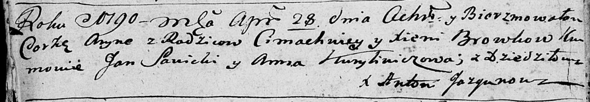
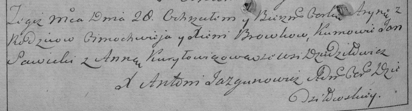

**Бровка Арына Тимофеева (Browkowna Aryna)**

28 апреля 1790 г -- крещение (НИАБ 136-13-894, лист 9об, №27/1790-р
(ориг)), (РГИА 823-2-18, лист 239об, №13/1790-р (коп)).

**НИАБ 136-13-894:** Лист 9об. **Метрическая запись №27/1790-р (ориг).**

Дедиловичская Покровская церковь. 28 апреля 1790 года. Метрическая
запись о крещении.

Browkowna Aryna -- дочь родителей с деревни Дедиловичи.

Browka Cimachwiey -- отец.

Browkowa Xienia -- мать.

Sawicki Jan - кум.

Kurylowiczowa Anna - кума.

Jazgunowicz Antoni -- ксёндз.

**РГИА 823-2-18:** Лист 239об. **Метрическая запись №13/1790-р (коп).**

Дедиловичская Покровская церковь. 28 апреля 1790 года. Метрическая
запись о крещении.

Browkowna Aryna -- дочь родителей с деревни Дедиловичи.

Browko Cimachwiey -- отец.

Browkowa Xienia -- мать.

Sawicki Jan -- кум.

Kuryłowiczowa Anna - кума.

Jazgunowicz Antoni -- ксёндз.
