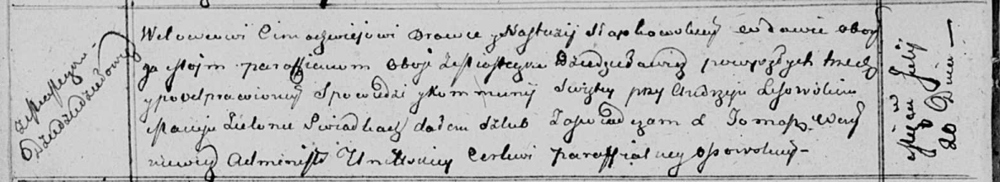

**Бровка (в предыдущем браке Слабковская) Настасья (Browkowa
(Słapkowska) Nastazyja)**

20 июля 1813 г -- венчание с вдовцом Тимофеем Бровкой с деревни
Дедиловичи (НИАБ 136-13-920, лист 19об, №9/1813-б (ориг)).

**НИАБ 136-13-894:** Лист 19об. **Метрическая запись №9/1813-б (ориг).**

Осовская Покровская церковь. 20 июля 1813 года. Запись о венчании.

Browka Cimachwiej -- жених, вдовец, парафии Осовской, местечко
Дедиловичи.

Słapkowska Nastazyja -- невеста, вдова, парафии Осовской, местечко
Дедиловичи.

Lisowski Andrzej -- свидетель.

Zielonka Maciej -- свидетель.

Woyniewicz Tomasz -- ксёндз.
