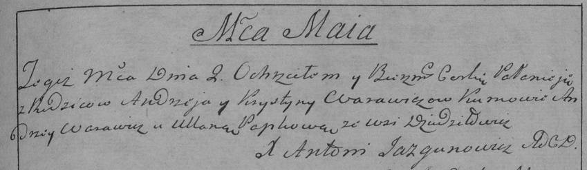

**Варавич Андрей (Warawicz Andrzej)**

4 февраля 1788 г -- крещение сына Изыдора (НИАБ 136-13-894, лист 4,
№16/1788-р (ориг)).

2 мая 1790 г -- крещение дочери Полонеи (НИАБ 136-13-894, лист 9об,
№29/1790-р (ориг)), (РГИА 823-2-18, лист 240, №14/1790-р (коп)).

1 мая 1792 г -- крещение сына Якуба (НИАБ 136-13-894, лист 15об,
№23/1792-р (ориг)), (РГИА 823-2-18, лист 244, №10/1792-р (коп)).

9 февраля 1796 г -- крещение дочери Евы (НИАБ 136-13-894, лист 28,
№19/1796-р (ориг)).

24 апреля 1798 г -- крещение сына Яна (НИАБ 136-13-894, лист 38об,
№17/1798-р (ориг)), (РГИА 823-2-18, лист 269, №17/1799-р (коп)).

28 мая 1802 г -- крещение сына Яна Стефана младшего (НИАБ 136-13-894,
лист 46об, №17/1802-р (ориг)).

29 сентября 1802 г -- отпевание, умер в возрасте 56 лет (родился около
1746 г) (НИАБ 136-13-919, лист 10, №12/1802-у (ориг)).

**НИАБ 136-13-894:** Лист 4. **Метрическая запись №16/1788-р (ориг).**

{width="6.496527777777778in"
height="1.2652438757655293in"}

Дедиловичская Покровская церковь. 4 февраля 1788 года. Метрическая
запись о крещении.

Warawicz Jzydor -- сын родителей с деревни Дедиловичи.

Warawicz Andrzej -- отец.

Warawiczowa Krystyna -- мать.

Warawicz Andrej - кум.

Popkowa Ullana - кума.

Żukowski Antoni -- ксёндз Мстижской церкви.

**НИАБ 136-13-894:** Лист 9об. **Метрическая запись №29/1790-р (ориг).**

{width="6.496527777777778in"
height="0.9172517497812773in"}

Дедиловичская Покровская церковь. 2 мая 1790 года. Метрическая запись о
крещении.

Warawiczowna Pałanieia -- дочь родителей с деревни Дедиловичи.

Warawicz Andrzej -- отец.

Warawiczowa Krystyna -- мать.

Warawicz Andrzey - кум.

Papkowa Ullana - кума.

Jazgunowicz Antoni -- ксёндз.

**РГИА 823-2-18:** Лист 240. **Метрическая запись №14/1790-р (коп).**

{width="6.496527777777778in"
height="1.8902777777777777in"}

Дедиловичская Покровская церковь. 2 мая 1790 года. Метрическая запись о
крещении.

Warawiczowna Pałanieja -- дочь родителей с деревни Дедиловичи.

Warawicz Andrzey -- отец.

Warawiczowa Krystyna -- мать.

Warawicz Andrzey -- кум.

Papkowa Ullana - кума.

Jazgunowicz Antoni -- ксёндз.

**НИАБ 136-13-894:** Лист 15об. **Метрическая запись №23/1792-р
(ориг).**

{width="6.496527777777778in"
height="0.8367913385826772in"}

Дедиловичская Покровская церковь. 1 мая 1792 года. Метрическая запись о
крещении.

Warawicz Jakub -- сын родителей с деревни Дедиловичи.

Warawicz Andrzey -- отец, селянин.

Warawicz Krystyna -- мать, селянка.

Browka Paweł - кум.

Papkowa Ullana - кума.

Jazgunowicz Antoni -- ксёндз.

**РГИА 823-2-18:** Лист 244. **Метрическая запись №10/1792-р (коп).**

{width="6.496527777777778in"
height="1.836111111111111in"}

Дедиловичская Покровская церковь. 1 мая 1792 года. Метрическая запись о
крещении.

Warawicz Jakub -- сын родителей с деревни Дедиловичи.

Warawicz Andrzey -- отец.

Warawiczowa Krystyna -- мать.

Browka Paweł -- кум.

Papkowa Uljana - кума.

Jazgunowicz Antoni -- ксёндз.

**НИАБ 136-13-894:** Лист 28. **Метрическая запись №19/1796-р (ориг).**

{width="6.496527777777778in"
height="0.8931135170603675in"}

Дедиловичская Покровская церковь. 9 февраля 1796 года. Метрическая
запись о крещении.

Warawiczowna Ewa -- дочь родителей с деревни Дедиловичи.

Warawicz Andrzey -- отец.

Warawichowa Krystyna -- мать.

Suszko Andrzey - кум.

Papkowa Ullana - кума.

Jazgunowicz Antoni -- ксёндз.

**НИАБ 136-13-894:** Лист 38об. **Метрическая запись №17/1799-р
(ориг).**

{width="6.496527777777778in"
height="1.1599748468941382in"}

Дедиловичская Покровская церковь. 24 апреля 1799 года. Метрическая
запись о крещении.

Warawicz Jan-- сын родителей с деревни Дедиловичи.

Warawicz Andrzey -- отец.

Warawiczowa Krystyna -- мать.

Warawicz Andrzey-- кум.

Tarasewiczowa Chwiedora -- кума.

Jazgunowicz Antoni -- ксёндз.

**РГИА 823-2-18:** Лист 269. **Метрическая запись №17/1799-р (коп).**

{width="6.496527777777778in"
height="1.5986111111111112in"}

Дедиловичская Покровская церковь. 24 апреля 1799 года. Метрическая
запись о крещении.

Warawicz Jan -- сын родителей с деревни Дедиловичи.

Warawicz Andrzey -- отец.

Warawicz Krystyna -- мать.

Warawicz Andrzey -- кум, с деревни Дедиловичи.

Tarasewiczowa Chwiedora -- кума, с деревни Дедиловичи.

Jazgunowicz Antoni -- ксёндз.

**НИАБ 136-13-894:** Лист 46об. **Метрическая запись №17/1802-р
(ориг).**

{width="6.496527777777778in"
height="1.6192705599300088in"}

Дедиловичская Покровская церковь. 28 мая 1802 года. Метрическая запись о
крещении.

Warawicz Jan Stefan -- сын родителей с деревни Дедиловичи.

Warawicz Andrzey -- отец.

Warawiczowa Krystyna -- мать.

Huzniak Leon -- кум.

Tarasewiczowa Chodora -- кума.

Jazgunowicz Antoni -- ксёндз.

**НИАБ 136-13-919:** Лист 13. **Метрическая запись №12/1802-у (ориг).**

{width="6.496527777777778in"
height="1.2347222222222223in"}

Дедиловичская Покровская церковь. 29 сентября 1802 года. Метрическая
запись об отпевании.

Warawicz Andrzey -- умерший, 56 лет, с деревни Дедиловичи, похоронен на
кладбище деревни Дедиловичи.

Jazgunowicz Antoni -- ксёндз.
