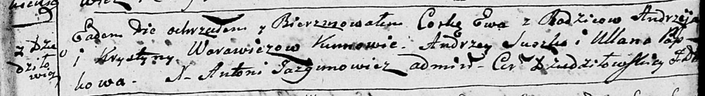

**Варавич Ева Андреева (Warawiczowna Ewa)**

9 февраля 1796 г -- крещение дочери Евы (НИАБ 136-13-894, лист 28,
№19/1796-р (ориг)).

**НИАБ 136-13-894:** Лист 28. **Метрическая запись №19/1796-р (ориг).**

Дедиловичская Покровская церковь. 9 февраля 1796 года. Метрическая
запись о крещении.

Warawiczowna Ewa -- дочь родителей с деревни Дедиловичи.

Warawicz Andrzey -- отец.

Warawichowa Krystyna -- мать.

Suszko Andrzey - кум.

Papkowa Ullana - кума.

Jazgunowicz Antoni -- ксёндз.
