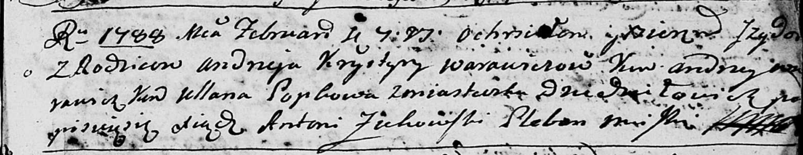

**Варавич Изыдор Андреев (Warawicz Jzydor)**

4 февраля 1788 г -- крещение (НИАБ 136-13-894, лист 4, №16/1788-р
(ориг)).

**НИАБ 136-13-894:** Лист 4. **Метрическая запись №16/1788-р (ориг).**

Дедиловичская Покровская церковь. 4 февраля 1788 года. Метрическая
запись о крещении.

Warawicz Jzydor -- сын родителей с деревни Дедиловичи.

Warawicz Andrzej -- отец.

Warawiczowa Krystyna -- мать.

Warawicz Andrej - кум.

Popkowa Ullana - кума.

Żukowski Antoni -- ксёндз Мстижской церкви.
