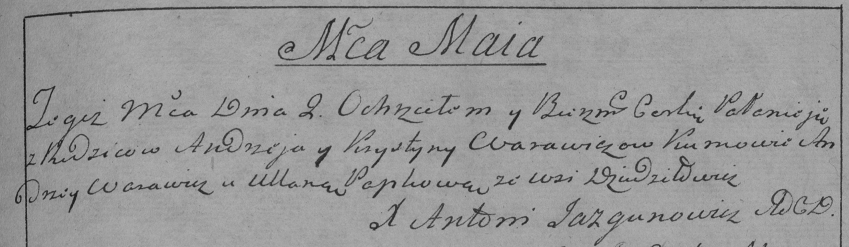

**Варавич Полонея Андреева (Warawicz Pałanieia)**

2 мая 1790 г -- крещение (НИАБ 136-13-894, лист 9об, №29/1790-р (ориг)),
(РГИА 823-2-18, лист 240, №14/1790-р (коп)).

**НИАБ 136-13-894:** Лист 9об. **Метрическая запись №29/1790-р (ориг).**

Дедиловичская Покровская церковь. 2 мая 1790 года. Метрическая запись о
крещении.

Warawiczowna Pałanieia -- дочь родителей с деревни Дедиловичи.

Warawicz Andrzej -- отец.

Warawiczowa Krystyna -- мать.

Warawicz Andrzey - кум.

Papkowa Ullana - кума.

Jazgunowicz Antoni -- ксёндз.

**РГИА 823-2-18:** Лист 240. **Метрическая запись №14/1790-р (коп).**

Дедиловичская Покровская церковь. 2 мая 1790 года. Метрическая запись о
крещении.

Warawiczowna Pałanieja -- дочь родителей с деревни Дедиловичи.

Warawicz Andrzey -- отец.

Warawiczowa Krystyna -- мать.

Warawicz Andrzey -- кум.

Papkowa Ullana - кума.

Jazgunowicz Antoni -- ксёндз.
