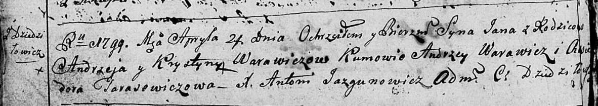
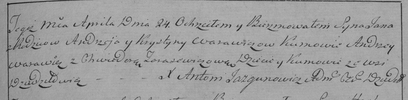

**Варавич Ян Андреев (Warawicz Jan)**

24 апреля 1798 г -- крещение сына Яна (НИАБ 136-13-894, лист 38об,
№17/1798-р (ориг)), (РГИА 823-2-18, лист 269, №17/1799-р (коп)).

**НИАБ 136-13-894:** Лист 38об. **Метрическая запись №17/1799-р
(ориг).**

Дедиловичская Покровская церковь. 24 апреля 1799 года. Метрическая
запись о крещении.

Warawicz Jan-- сын родителей с деревни Дедиловичи.

Warawicz Andrzey -- отец.

Warawiczowa Krystyna -- мать.

Warawicz Andrzey-- кум.

Tarasewiczowa Chwiedora -- кума.

Jazgunowicz Antoni -- ксёндз.

**РГИА 823-2-18:** Лист 269. **Метрическая запись №17/1799-р (коп).**

Дедиловичская Покровская церковь. 24 апреля 1799 года. Метрическая
запись о крещении.

Warawicz Jan -- сын родителей с деревни Дедиловичи.

Warawicz Andrzey -- отец.

Warawicz Krystyna -- мать.

Warawicz Andrzey -- кум, с деревни Дедиловичи.

Tarasewiczowa Chwiedora -- кума, с деревни Дедиловичи.

Jazgunowicz Antoni -- ксёндз.
