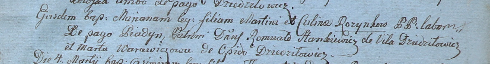
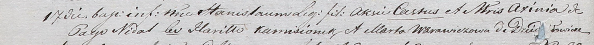
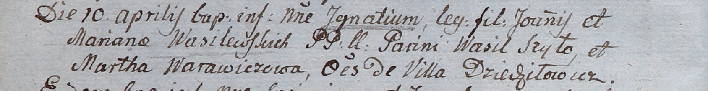
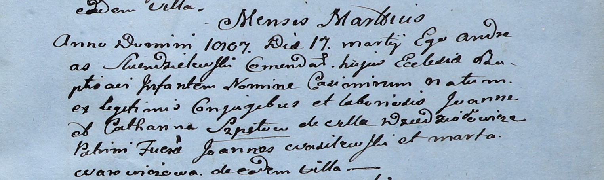

**Варавич Марта (Warawiczowa Marta)**

29 января 1800 г -- крестная мать Марьяны, дочери Мартина и Кулины
Розынков с деревни Пядань (НИАБ 937-4-32, лист 1, №3/1800-р).

17 ноября 1801 г -- крестная мать Станислава, сына Кастуся и Аксини с
деревни Недаль (НИАБ 937-4-32, лист 4об, №24/1801-р).

10 апреля 1805 г -- крестная мать Игнатия, сына Яна и Марьяны
Василевских с деревни Дедиловичи (НИАБ 937-4-32, лист 11об, №16/1805-р).

17 марта 1807 г -- крестная мать Казимира, сына Иоанна и Катарины Шпетов
с деревни Дедиловичи (НИАБ 937-4-32, лист 15, №6/1807-р).

**НИАБ 937-4-32:** Лист 1. **Метрическая запись №3/1800-р.**

Дедиловичский костел Наисвятейшего Сердца Иисуса. 29 января 1800 года.
Метрическая запись о крещении.

Rozynkowna Mariana -- дочь крестьян с деревни Пядань.

Rozynko Martin -- отец.

Rozynkowa Culina -- мать.

Stankiewicz Romuald -- крестный отец, шляхтич, с деревни Дедиловичи.

Warawiczowa Marta -- крестная мать, с деревни Дедиловичи.

Linhart Hyacinthus -- ксёндз.

**НИАБ 937-4-32:** Лист 4об. **Метрическая запись №24/1801-р.**

Дедиловичский костел Наисвятейшего Сердца Иисуса. 17 ноября 1801 года.
Метрическая запись о крещении.

Stanisław -- сын родителей с деревни Недаль.

Castus -- отец.

Axinia -- мать.

Kamisionek Hariłło -- крестный отец, с деревни Дедиловичи.

Warawiczowa Marta -- крестная мать, с деревни Дедиловичи.

Linhart Hyacinthus -- ксёндз.

**НИАБ 937-4-32:** Лист 11об. **Метрическая запись №16/1805-р.**

Дедиловичский костел Наисвятейшего Сердца Иисуса. 10 апреля 1805 года.
Метрическая запись о крещении.

Wasilewski Jgnati -- сын родителей с деревни Дедиловичи.

Wasilewski Joann -- отец.

Wasilewska Mariana -- мать.

Szyło Wasil -- крестный отец, с деревни Дедиловичи.

Warawiczowa Martha -- крестная мать, с деревни Дедиловичи.

Linhart Hiacinthus -- ксёндз.

**НИАБ 937-4-32:** Лист 15. **Метрическая запись №6/1807-р.**

Дедиловичский костел Наисвятейшего Сердца Иисуса. 17 марта 1807 года.
Метрическая запись о крещении.

Szpet Casimir -- сын крестьян с деревни Дедиловичи.

Szpet Joann -- отец.

Szpetowa Catharina -- мать.

Wasilewski Joann -- крестный отец.

Warawiczowa Marta -- крестная мать, с деревни Дедиловичи.

Skindzelewski Andreas -- ксёндз, комендант Дедиловичский.
