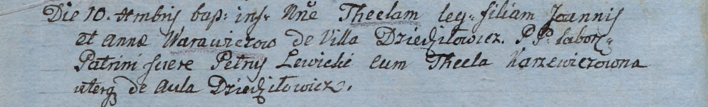

**Варавич Анна (Warawiczowa Anna)**

10 декабря 1805 г -- крещение дочери Текли (НИАБ 937-4-32, лист 12об,
№45/1805-р).

**НИАБ 937-4-32:** Лист 12об. **Метрическая запись №45/1805-р.**

Дедиловичский костел Наисвятейшего Сердца Иисуса. 10 декабря 1805 года.
Метрическая запись о крещении.

Warawiczowna Thecla -- дочь крестьян с деревни Дедиловичи.

Warawicz Joann -- отец.

Warawiczowa Anna -- мать.

Lewicki Petrus -- крестный отец, со двора Дедиловичи.

Karzewiczowna Thecla -- крестная мать, со двора Дедиловичи.

Linhart Hiacinthus -- ксёндз.
