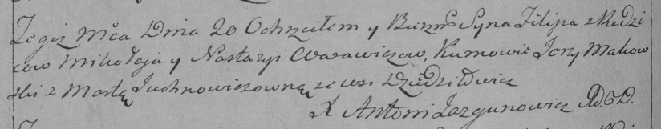

**Варавич (Молчун) Настасья (Warawiczowa Nastazya z Mauczunow)**

4 июля 1792 г -- венчание с Миколаем Варавичем с деревни Дедиловичи
(НИАБ 136-13-894, лист 70об, №9/1792-б (ориг)).

20 ноября 1793 г -- крещение сына Филиппа (НИАБ 136-13-894, лист 20об,
№80/1793-р (ориг)), (РГИА 823-2-18, лист 248об, №46/1793-р (коп)).

**НИАБ 136-13-894:** Лист 70об. **Метрическая запись №9/1792-б (ориг).**

{width="6.496527777777778in"
height="1.2739599737532807in"}

Дедиловичская Покровская церковь. 4 июля 1792 года. Метрическая запись о
венчании.

Warawicz Mikołay -- жених, вдовец, с деревни Дедиловичи.

Mauczunowa Nastazya -- невеста.

Słabkowski Antoni -- свидетель.

Axiuta Andrzey -- свидетель.

Jazgunowicz Antoni -- ксёндз.

**НИАБ 136-13-894:** Лист 20-об. **Метрическая запись №80/1793-р
(ориг).**

{width="6.496527777777778in"
height="1.1874650043744532in"}

Дедиловичская Покровская церковь. 20 ноября 1793 года. Метрическая
запись о крещении.

Warawicz Filip -- сын родителей с деревни Дедиловичи.

Warawicz Mikołay -- отец.

Warawiczowa Nastazya-- мать.

Makowski Jerzy - кум.

Juchnowiczowna Marta - кума.

Jazgunowicz Antoni -- ксёндз.

**РГИА 823-2-18:** Лист 248об. **Метрическая запись №46/1793-р (коп).**

{width="6.496527777777778in"
height="1.2694444444444444in"}

Дедиловичская Покровская церковь. 20 ноября 1793 года. Метрическая
запись о крещении.

Warawicz Filip -- сын родителей с деревни Дедиловичи.

Warawicz Mikołay -- отец.

Warawiczowa Nastazya -- мать.

Makowski Jerzy -- кум.

Juchnowiczowna Marta -- кума.

Jazgunowicz Antoni -- ксёндз.
