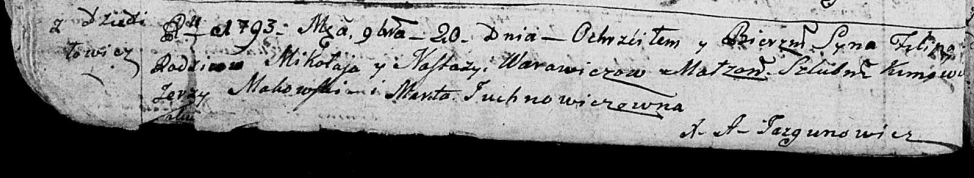

**Варавич Филип Миколаев (Warawicz Filip)**

20 ноября 1793 г -- крещение сына Филипа (НИАБ 136-13-894, лист 20об,
№80/1793-р (ориг)), (РГИА 823-2-18, лист 248об, №46/1793-р (коп)).

**НИАБ 136-13-894:** Лист 20-об. **Метрическая запись №80/1793-р
(ориг).**

Дедиловичская Покровская церковь. 20 ноября 1793 года. Метрическая
запись о крещении.

Warawicz Filip -- сын родителей с деревни Дедиловичи.

Warawicz Mikołay -- отец.

Warawiczowa Nastazya-- мать.

Makowski Jerzy - кум.

Juchnowiczowna Marta - кума.

Jazgunowicz Antoni -- ксёндз.

**РГИА 823-2-18:** Лист 248об. **Метрическая запись №46/1793-р (коп).**

Дедиловичская Покровская церковь. 20 ноября 1793 года. Метрическая
запись о крещении.

Warawicz Filip -- сын родителей с деревни Дедиловичи.

Warawicz Mikołay -- отец.

Warawiczowa Nastazya -- мать.

Makowski Jerzy -- кум.

Juchnowiczowna Marta -- кума.

Jazgunowicz Antoni -- ксёндз.
