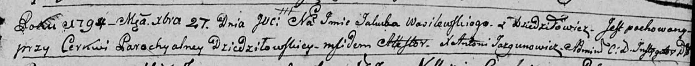

**Василевский Якуб (Wasilewski Jakub)**

27 декабря 1794 г -- отпевание (НИАБ 136-13-919, лист 4, №70/1794-у
(ориг)).

**НИАБ 136-13-919:** Лист 4. **Метрическая запись №70/1794-у (ориг).**

{width="6.496527777777778in"
height="0.6229166666666667in"}

Дедиловичская Покровская церковь. 27 декабря 1794 года. Метрическая
запись об отпевании.

Wasilewski Jakub -- умерший, с деревни Дедиловичи, похоронен на кладбище
при церкви Дедиловичской.

Jazgunowicz Antoni -- ксёндз.
