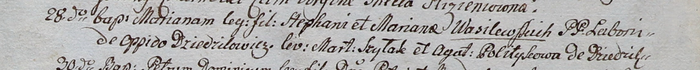

**Василевская Марьяна Стефанова (Wasilewska Mariana)**

28 сентября 1800 г -- крещение (НИАБ 937-4-32, лист 3, №30/1800-р).

**НИАБ 937-4-32:** Лист 3. **Метрическая запись №30/1800-р.**

{width="6.496527777777778in"
height="0.6555555555555556in"}

Дедиловичский костел Наисвятейшего Сердца Иисуса. 28 сентября 1800 года.
Метрическая запись о крещении.

Wasilewska Mariana -- дочь крестьян с деревни Дедиловичи.

Wasilewski Stephan -- отец.

Wasilewska Mariana -- мать.

Szyłak Marcin -- крестный отец.

Politykowa Agatha -- крестная мать, с деревни Дедиловичи.

Linhart Hyacinthus -- ксёндз.
