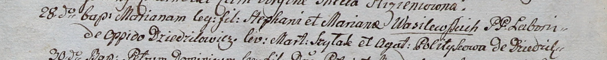

**Василевский Стефан (Wasilewski Stephan)**

28 сентября 1800 г -- крещение дочери Марьяны (НИАБ 937-4-32, лист 3,
№30/1800-р).

21 ноября 1802 г -- крещение сына Иоанна (НИАБ 937-4-32, лист 7об,
№39/1802-р).

21 ноября 1804 г -- крестный отец Марьяны, дочери Иосифа и Катарины Шил
с деревни Дедиловичи (НИАБ 937-4-32, лист 10об, №23/1804-р).

15 августа 1807 г -- крещение сына Игнатия (НИАБ 937-4-32, лист 16,
№14/1807-р).

6 февраля 1810 г -- крещение сына Петра (НИАБ 937-4-32, лист 21об,
№7/1810-р).

11 февраля 1812 г -- крещение сына Мартина (НИАБ 937-4-32, лист 24,
№3/1812-р).

**НИАБ 937-4-32:** Лист 3. **Метрическая запись №30/1800-р.**

Дедиловичский костел Наисвятейшего Сердца Иисуса. 28 сентября 1800 года.
Метрическая запись о крещении.

Wasilewska Mariana -- дочь крестьян с деревни Дедиловичи.

Wasilewski Stephan -- отец.

Wasilewska Mariana -- мать.

Szyłak Marcin -- крестный отец.

Politykowa Agatha -- крестная мать, с деревни Дедиловичи.

Linhart Hyacinthus -- ксёндз.

**НИАБ 937-4-32:** Лист 7об. **Метрическая запись №39/1802-р.**

Дедиловичский костел Наисвятейшего Сердца Иисуса. 21 ноября 1802 года.
Метрическая запись о крещении.

Wasilewski Joann -- сын крестьян с местечка Дедиловичи.

Wasilewski Stephan -- отец.

Wasilewska Mariana -- мать.

Szyło Maximilian -- крестный отец.

Charewiczowa Martha -- крестная мать, с деревни Дедиловичи.

Linhart Hyacinthus -- ксёндз.

**НИАБ 937-4-32:** Лист 10об. **Метрическая запись №23/1804-р.**

Дедиловичский костел Наисвятейшего Сердца Иисуса. 21 ноября 1804 года.
Метрическая запись о крещении.

Szyłowna Marianna -- дочь крестьян с деревни Дедиловичи.

Szyło Joseph -- отец.

Szyłowa Catharina -- мать.

Wasilewski Stephan -- крестный отец, с деревни Дедиловичи.

Sawicka Barbara -- крестная мать, с деревни Дедиловичи.

Galinowski Joann -- ксёндз, комендант Дедиловичского костела.

**НИАБ 937-4-32:** Лист 16. **Метрическая запись №14/1807-р.**

Дедиловичский костел Наисвятейшего Сердца Иисуса. 15 августа 1807 года.
Метрическая запись о крещении.

Wasilewski Jgnati -- сын крестьян с деревни Дедиловичи.

Wasilewski Stephan -- отец.

Wasilewska Maria -- мать.

Szabłowski Paul -- крестный отец.

Juchnowa Martha -- крестная мать, с деревни Дедиловичи.

Scindzelewski Andreas -- ксёндз, викарий Дедиловичский.

**НИАБ 937-4-32:** Лист 21об. **Метрическая запись №7/1810-р.**

Дедиловичский костел Наисвятейшего Сердца Иисуса. 6 февраля 1810 года.
Метрическая запись о крещении.

Wasilewski Petrus -- сын крестьян с деревни Дедиловичи.

Wasilewski Stephan -- отец.

Wasilewska Marta -- мать.

Słabkowski Paul -- крестный отец.

Warawiczowa Marta -- крестная мать.

Zychowski Gabriel -- ксёндз.

**НИАБ 937-4-32:** Лист 24. **Метрическая запись №3/1812-р.**

Дедиловичский костел Наисвятейшего Сердца Иисуса. 11 февраля 1812 года.
Метрическая запись о крещении.

Wasilewski Martin -- сын крестьян с деревни Дедиловичи.

Wasilewski Stephan -- отец.

Wasilewska Marta -- мать.

Słabkowski Paul -- крестный отец.

Warawiczowa Maria -- крестная мать.

Zychowski Gabriel -- ксёндз.
