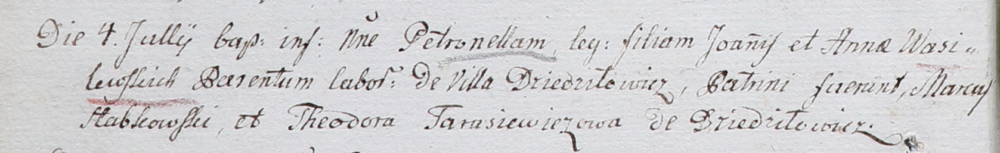

**Василевский Иосиф Янов (Wasilewski Jozef)**

29 декабря 1790 г -- крещение (НИАБ 136-13-894, лист 12, №90/1790-р
(ориг)), (РГИА 823-2-18, лист 241, №36/1790-р (коп)).

**НИАБ 136-13-894:** Лист 12. **Метрическая запись №90/1790-р (ориг).**

{width="6.496527777777778in"
height="0.9031703849518811in"}

Дедиловичская Покровская церковь. 29 декабря 1790 года. Метрическая
запись о крещении.

Wasilewski Jozef -- сын родителей с деревни Дедиловичи.

Wasilewski Janka -- отец.

Wasilewska Anna -- мать.

Słabkowski Janka? - кум.

Nowikowa Pałanieja - кума.

Jazgunowicz Antoni -- ксёндз.

**РГИА 823-2-18:** Лист 241. **Метрическая запись №36/1790-р (коп).**

{width="6.496527777777778in"
height="2.1756944444444444in"}

Дедиловичская Покровская церковь. 29 декабря 1790 года. Метрическая
запись о крещении.

Wasilewski Jozef -- сын родителей с деревни Дедиловичи.

Wasilewski Jan -- отец.

Wasilewska Anna -- мать.

Słabkowski Marko -- кум.

Nowikowa Połonieja - кума.

Jazgunowicz Antoni -- ксёндз.
