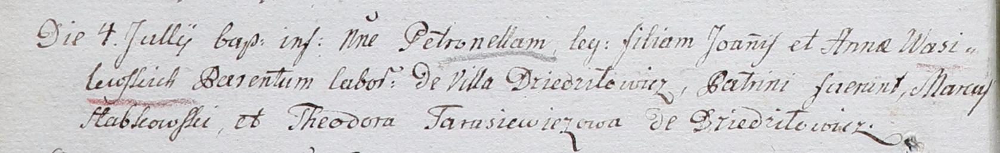

**Василевский Лука Янов (Wasilewski Łukasz)**

17 октября 1792 г -- крещение (НИАБ 136-13-894, лист 17, №64/1792-р
(ориг)).

**НИАБ 136-13-894:** Лист 17. **Метрическая запись №64/1792-р (ориг).**

{width="6.496527777777778in"
height="0.8575765529308836in"}

Дедиловичская Покровская церковь. 17 октября 1792 года. Метрическая
запись о крещении.

Wasilewski Łukasz -- сын родителей с деревни Дедиловичи.

Wasilewski Janka -- отец.

Wasilewska Anna -- мать.

Słapkowski Marka - кум.

Papkowa Ullana - кума.

Jazgunowicz Antoni -- ксёндз.
