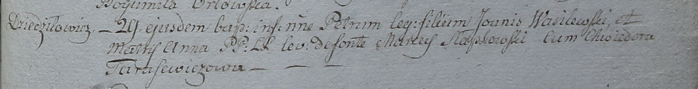

**Василевский Пётр Янов (Wasilewski Petrus)**

29 июня 1798 г -- крещение (НИАБ 1781-27-199, лист 122, №8/1798-р).

**НИАБ 1781-27-199:** Лист 122. **Метрическая запись №8/1798-р.**

Дедиловичский костел Наисвятейшего Сердца Иисуса. 29 июня 1798 года.
Метрическая запись о крещении.

Wasilewski Petrus -- сын крестьян с деревни Дедиловичи.

Wasilewski Joanis -- отец.

Wasilewska Anna -- мать.

Słapkowski Marcus -- крестный отец.

Tarasewiczowa Chwiedora - крестная мать.

Linhart Hyacinthus -- ксёндз.
