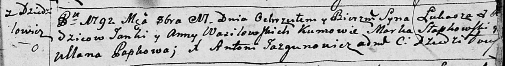

**Василевский Ян (Wasilewski Janka)**

29 декабря 1790 г -- крещение сына Иосифа (НИАБ 136-13-894, лист 12,
№90/1790-р (ориг)), (РГИА 823-2-18, лист 241, №36/1790-р (коп)).

17 октября 1792 г -- крещение сына Луки (НИАБ 136-13-894, лист 17,
№64/1792-р (ориг)).

17 августа 1796 г -- крещение сына Антона (НИАБ 136-13-894, лист 30,
№72/1796-р (ориг)), (РГИА 823-2-18, лист 257, №42/1796-р (коп)).

29 июня 1798 г -- крещение сына Петра (НИАБ 1781-27-199, лист 122,
№8/1798-р).

28 марта 1800 г -- крестный отец Катерыны, дочери Максыма и Зыновии
Бровков с деревни Дедиловичи (НИАБ 937-4-32, лист 1, №8/1800-р).

5 августа 1800 г -- крещение сына Доминика (НИАБ 937-4-32, лист 2,
№25/1800-р).

18 мая 1802 г -- крестный отец у Агнешки Домицели, дочери Захаревичей
Прокопа и Марьяны с деревни Дедиловичи (НИАБ 136-13-894, лист 46об,
№16/1802-р (ориг)).

4 июля 1802 г -- крещение дочери Петронели (НИАБ 937-4-32, лист 6об,
№18/1802-р).

**НИАБ 136-13-894:** Лист 12. **Метрическая запись №90/1790-р (ориг).**

Дедиловичская Покровская церковь. 29 декабря 1790 года. Метрическая
запись о крещении.

Wasilewski Jozef -- сын родителей с деревни Дедиловичи.

Wasilewski Janka -- отец.

Wasilewska Anna -- мать.

Słabkowski Janka? - кум.

Nowikowa Pałanieja - кума.

Jazgunowicz Antoni -- ксёндз.

**РГИА 823-2-18:** Лист 241. **Метрическая запись №36/1790-р (коп).**

Дедиловичская Покровская церковь. 29 декабря 1790 года. Метрическая
запись о крещении.

Wasilewski Jozef -- сын родителей с деревни Дедиловичи.

Wasilewski Jan -- отец.

Wasilewska Anna -- мать.

Słabkowski Marko -- кум.

Nowikowa Połonieja - кума.

Jazgunowicz Antoni -- ксёндз.

**НИАБ 136-13-894:** Лист 17. **Метрическая запись №64/1792-р (ориг).**

Дедиловичская Покровская церковь. 17 октября 1792 года. Метрическая
запись о крещении.

Wasilewski Łukasz -- сын родителей с деревни Дедиловичи.

Wasilewski Janka -- отец.

Wasilewska Anna -- мать.

Słapkowski Marka - кум.

Papkowa Ullana - кума.

Jazgunowicz Antoni -- ксёндз.

**НИАБ 136-13-894:** Лист 30. **Метрическая запись №72/1796-р (ориг).**

Дедиловичская Покровская церковь. 17 августа 1796 года. Метрическая
запись о крещении.

Wasilewski Antoni -- сын родителей с деревни Дедиловичи.

Wasilewski Jan -- отец.

Wasilewska Anna -- мать.

Słapkowski Marko - кум.

Papkowa Ullana - кума.

Jazgunowicz Antoni -- ксёндз.

**РГИА 823-2-18:** Лист 257. **Метрическая запись №42/1796-р (коп).**

Дедиловичская Покровская церковь. 17 августа 1796 года. Метрическая
запись о крещении.

Wasilewski Antoni -- сын родителей с деревни Дедиловичи.

Wasilewski Jan -- отец.

Wasilewska Anna -- мать.

Słapkowski Marko -- кум.

Papkowa Uljana -- кума.

Jazgunowicz Antoni -- ксёндз.

**НИАБ 1781-27-199:** Лист 122. **Метрическая запись №8/1798-р.**

Дедиловичский костел Наисвятейшего Сердца Иисуса. 29 июня 1798 года.
Метрическая запись о крещении.

Wasilewski Petrus -- сын крестьян с деревни Дедиловичи.

Wasilewski Joanis -- отец.

Wasilewska Anna -- мать.

Słapkowski Marcus -- крестный отец.

Tarasewiczowa Chwiedora - крестная мать.

Linhart Hyacinthus -- ксёндз.

**НИАБ 937-4-32:** Лист 1. **Метрическая запись №8/1800-р.**

Дедиловичский костел Наисвятейшего Сердца Иисуса. 28 марта 1800 года.
Метрическая запись о крещении.

Brouchowna Catharina -- дочь крестьян с деревни Дедиловичи.

Broucha Maxim -- отец.

Brouchowa Zenowia -- мать.

Wasilewski Joann -- крестный отец, с деревни Дедиловичи.

Jacukowa Frosina -- крестная мать, с деревни Дедиловичи.

Linhart Hyacinthus -- ксёндз.

**НИАБ 937-4-32:** Лист 2. **Метрическая запись №25/1800-р.**

Дедиловичский костел Наисвятейшего Сердца Иисуса. 5 августа 1800 года.
Метрическая запись о крещении.

Wasilewski Dominic -- сын крестьян с деревни Дедиловичи.

Wasilewski Joann -- отец.

Wasilewska Anna -- мать.

Słapkowski Marcus -- крестный отец, с деревни Дедиловичи.

Tarasewiczowa Theodora -- крестная мать, с деревни Дедиловичи.

Linhart Hyacinthus -- ксёндз.

**НИАБ 136-13-894:** Лист 46об. **Метрическая запись №16/1802-р
(ориг).**

Дедиловичская Покровская церковь. 18 мая 1802 года. Метрическая запись о
крещении.

Zacharewiczowna Agnieszka Domicella -- дочь родителей с деревни
Дедиловичи.

Zacharewicz Prokop -- отец.

Zacharewiczowa Marjana -- мать.

Wasilewski Jan -- кум, с деревни Дедиловичи.

Szydłanko Magdalena -- кума, с деревни Дедиловичи.

Jazgunowicz Antoni -- ксёндз.

**НИАБ 937-4-32:** Лист 6об. **Метрическая запись №18/1802-р.**

Дедиловичский костел Наисвятейшего Сердца Иисуса. 4 июля 1802 года.
Метрическая запись о крещении.

Wasilewska Petronella -- дочь крестьян с деревни Дедиловичи.

Wasilewski Joann -- отец.

Wasilewska Anna -- мать.

Słabkowski Marco -- крестный отец.

Tarasewiczowa Theodora -- крестная мать, с деревни Дедиловичи.

Linhart Hyacinthus -- ксёндз.
