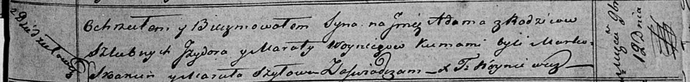

**Войнич Изыдор (Woynicz Jzydor)**

12 ноября 1819 г -- крещение сына Адама (НИАБ 136-13-894, лист 103,
№58/1819-р (ориг)).

**НИАБ 136-13-894:** Лист 103. **Метрическая запись №58/1819-р (ориг).**

{width="6.496527777777778in"
height="0.7797976815398076in"}

Осовская Покровская церковь. 12 ноября 1819 года. Метрическая запись о
крещении.

Woynicz Adam -- сын родителей с деревни Дедиловичи.

Woynicz Jzydor -- отец.

Woyniczowa Maruta -- мать.

Skakun Marko -- кум.

Szyłowa Maruta -- кума.

Woyniewicz Tomasz -- ксёндз.
