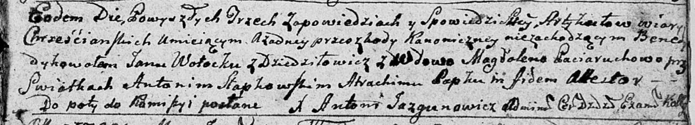

**Волоцкая Магдалена (Wołocka Magdalena)**

12 сентября 1791 г -- венчание с Яном Волоцким с деревни Дедиловичи
(НИАБ 136-13-894, лист 70, №19/1791-б (ориг)).

**НИАБ 136-13-894:** Лист 70. **Метрическая запись №19/1791-б (ориг).**

Дедиловичская Покровская церковь. 12 сентября 1791 года. Метрическая
запись о венчании.

Wołocki Jan -- жених, с деревни Дедиловичи.

Paciaruchowa Magdalena -- невеста, вдова.

Słabkowski Antoni -- свидетель.

Papko Atrachim -- свидетель.

Jazgunowicz Antoni -- ксёндз.
