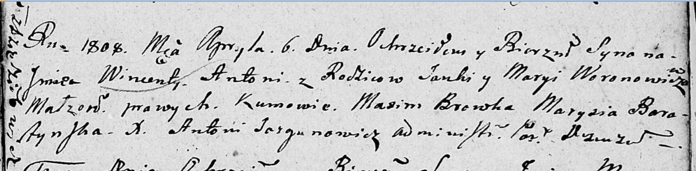

**Воронович Винцент Янков (Woronowicz Wincenty Antoni)**

6 апреля 1808 г -- крещение (НИАБ 136-13-894, лист 65, №16/1808-р
(ориг)).

**НИАБ 136-13-894:** Лист 65. **Метрическая запись №16/1808-р (ориг).**

{width="6.496527777777778in"
height="1.6038495188101487in"}

Дедиловичская Покровская церковь. 6 апреля 1808 года. Метрическая запись
о крещении.

Woronowicz Wincenty Antoni -- сын родителей с деревни Дедиловичи.

Woronowicz Janka -- отец.

Woronowiczowa Maryia -- мать.

Browka Maxim -- кум.

Baratynska Marysia -- кума.

Jazgunowicz Antoni -- ксёндз.
