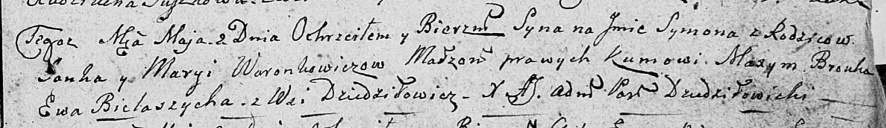

**Воронович Янка (Woronowicz, Woronkowicz Janka)**

6 апреля 1808 г -- крещение сына Винцента Антония (НИАБ 136-13-894, лист
65, №16/1808-р (ориг)).

2 мая 1809 г -- крещение сына Сымона (НИАБ 136-13-894, лист 74,
№20/1809-р (ориг)).

**НИАБ 136-13-894:** Лист 65. **Метрическая запись №16/1808-р (ориг).**

{width="6.496527777777778in"
height="1.6038495188101487in"}

Дедиловичская Покровская церковь. 6 апреля 1808 года. Метрическая запись
о крещении.

Woronowicz Wincenty Antoni -- сын родителей с деревни Дедиловичи.

Woronowicz Janka -- отец.

Woronowiczowa Maryia -- мать.

Browka Maxim -- кум.

Baratynska Marysia -- кума.

Jazgunowicz Antoni -- ксёндз.

**НИАБ 136-13-894:** Лист 74. **Метрическая запись №20/1809-р (ориг).**

{width="6.496527777777778in"
height="0.9447419072615924in"}

Дедиловичская Покровская церковь. 2 мая 1809 года. Метрическая запись о
крещении .

Woronkowicz Symon -- сын родителей с деревни Дедиловичи.

Woronkowicz Janka -- отец.

Woronkowiczowa Marya -- мать.

Brouka Maxym -- кум.

Bielaszycha Ewa -- кума.

Jazgunowicz Antoni -- ксёндз.
