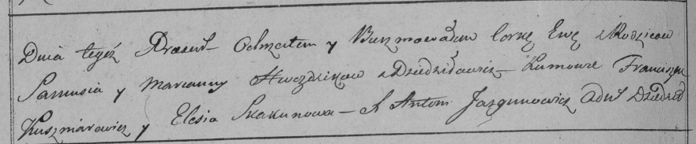

**Гвоздик Ева Самусева (Hwozdzikowna Ewa)**

29 июня 1798 г -- крещение (НИАБ 136-13-894, лист 36, №29/1798-р
(ориг)), (РГИА 823-2-18, лист 264об, №29/1798-р (коп)).

**НИАБ 136-13-894:** Лист 36. **Метрическая запись №29/1798-р (ориг).**

{width="6.496527777777778in"
height="0.7992421259842519in"}

Дедиловичская Покровская церковь. 29 июня 1798 года. Метрическая запись
о крещении.

Hwozdzikowna Ewa -- дочь родителей с деревни Дедиловичи.

Hwozdzik Samuś -- отец.

Hwozdzikowa Marjana -- мать.

Kuszniarewicz Franciszek - кум.

Skakunowa Elesia - кума.

Jazgunowicz Antoni -- ксёндз.

**РГИА 823-2-18:** Лист 264об. **Метрическая запись №29/1798-р (коп).**

{width="6.496527777777778in"
height="1.3493055555555555in"}

Дедиловичская Покровская церковь. 29 июня 1798 года. Метрическая запись
о крещении.

Hwezdzicka Ewa -- дочь родителей с деревни Дедиловичи.

Hwezdzicki Samuś -- отец.

Hwezdzicka Marianna -- мать.

Kuszniarewicz Franciszek -- кум.

Skakunowa Elesia -- кума.

Jazgunowicz Antoni -- ксёндз.
