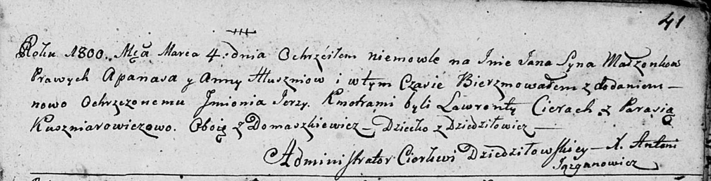
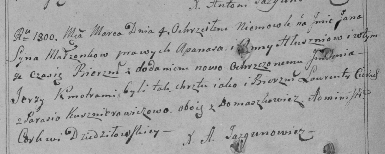
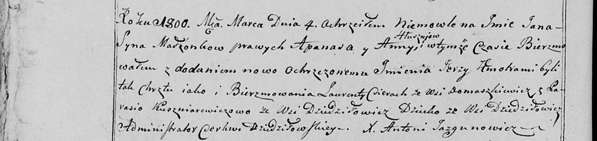

**Глушень Ян Апанасов (Hłuszeń Jan Jerzy)**

4 марта 1800 г -- крещение (НИАБ 136-13-894, лист 41, №9/1800-р (ориг),
РГИА 823-2-18, лист 274об, №9/1800-р (коп), НИАБ 136-13-949, лист 101об,
№9/1800-р (коп)).

**НИАБ 136-13-894:** Лист 41. **Метрическая запись №9/1800-р (ориг).**

Дедиловичская Покровская церковь. 4 марта 1800 года. Метрическая запись
о крещении.

Hłuszeń Jan Jerzy -- сын родителей с деревни Дедиловичи.

Hłuszeń Apanas -- отец.

Hłuszniowa Anna -- мать.

Cierach Lawrenty -- кум, с деревни Домашковичи.

Kuszniarowiczowa Parasia -- кума, с деревни Домашковичи.

Jazgunowicz Antoni -- ксёндз.

**РГИА 823-2-18:** Лист 274об. **Метрическая запись №9/1800-р (коп).**

Дедиловичская Покровская церковь. 4 марта 1800 года. Метрическая запись
о крещении.

Hłuszeń Jan Jerzy -- сын родителей с деревни \[Дедиловичи\].

Hłuszeń Apanas -- отец.

Hłuszniowa Anna -- мать.

Cierach Laurenty -- кум, с деревни Домашковичи.

Kusznierowiczowa Parasia -- кума, с деревни Домашковичи.

Jazgunowicz Antoni -- ксёндз.

**НИАБ 136-13-949:** Лист 101об. **Метрическая запись №9/1800-р (коп).**

(См. тж.: РГИА 823-2-18, лист 274об, №9/1800-р (коп), НИАБ 136-13-894,
лист 41, №9/1800-р (ориг))

Дедиловичская Покровская церковь. 4 марта 1800 года. Метрическая запись
о крещении.

Hłuszeń Jan Jerzy -- сын родителей с деревни Дедиловичи.

Hłuszeń Apanas -- отец.

Hłuszniowa Anna -- мать.

Cierac Łaurenty -- кум, с деревни Домашковичи.

Kuszniarewiczowa Parasia - кума, с деревни Дедиловичи \[Домашковичи\].

Jazgunowicz Antoni -- ксёндз.
