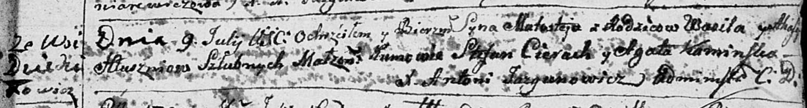
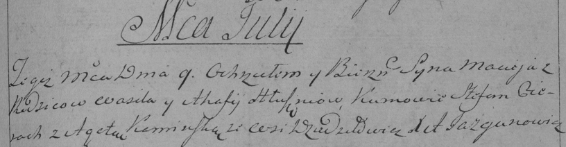

**Глушень Агафия (Hłuszniowa Ahafija)**

9 июля 1794 г -- крещение сына Маластея (НИАБ 136-13-894, лист 22,
№26/1794-р (ориг)), (РГИА 823-2-18, лист 250, №17/1794-р (коп)).

**НИАБ 136-13-894:** Лист 22. **Метрическая запись №26/1794-р (ориг).**

Дедиловичская Покровская церковь. 9 июля 1794 года. Метрическая запись о
крещении.

Hłuszeń Małastey -- сын родителей с деревни Дедиловичи.

Hłuszeń Wasil -- отец.

Hłuszniowa Ahafija -- мать.

Cierach Stefan - кум.

Kaminska Agata - кума.

Jazgunowicz Antoni -- ксёндз.

**РГИА 823-2-18:** Лист 250. **Метрическая запись №17/1794-р (коп).**

Дедиловичская Покровская церковь. 9 июля 1794 года. Метрическая запись о
крещении.

Hłuszeń Maciey -- сын родителей с деревни Дедиловичи.

Hłuszeń Wasil -- отец.

Hłuszniowa Ahafija -- мать.

Cierach Stefan -- кум.

Kaminska Agata -- кума.

Jazgunowicz Antoni -- ксёндз.
