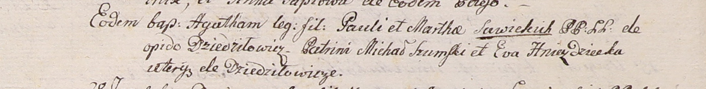
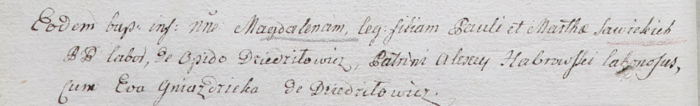
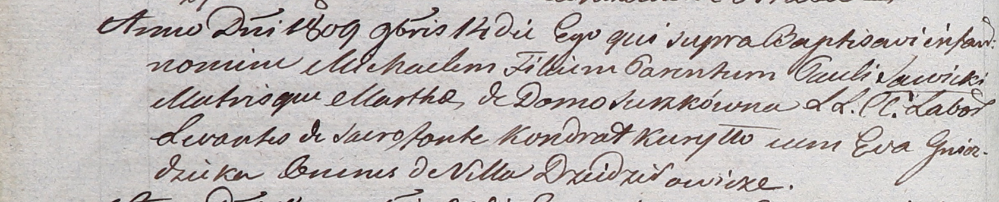

**Гнездицкая Ева (Hniezdzicka Eva)**

Январь 1801 -- крестная мать Агаты, дочери Павла и Марты Савицких с
деревни Дедиловичи (НИАБ 937-4-32, лист 4, №2/1800-р).

20 ноября 1802 г -- крестная мать Магдалены, дочери Павла и Марты
Савицких с деревни Дедиловичи (НИАБ 937-4-32, лист 7об, №38/1802-р).

14 ноября 1809 г -- крестная мать Михала, сына Павла и Марты Савицких с
деревни Дедиловичи (НИАБ 937-4-32, лист 20об, №31/1809-р).

**НИАБ 937-4-32:** Лист 4. **Метрическая запись №2/1801-р.**

Дедиловичский костел Наисвятейшего Сердца Иисуса. Января 1801 года.
Метрическая запись о крещении.

Sawicka Agatha -- дочь крестьян с деревни Дедиловичи.

Sawicki Paul -- отец.

Sawicka Martha -- мать.

Szumski Michał -- крестный отец, с деревни Дедиловичи.

Hniezdzicka Ewa -- крестная мать, с деревни Дедиловичи.

Linhart Hyacinthus -- ксёндз.

**НИАБ 937-4-32:** Лист 7об. **Метрическая запись №38/1802-р.**

Дедиловичский костел Наисвятейшего Сердца Иисуса. 20 ноября 1802 года.
Метрическая запись о крещении.

Sawicka Magdalena -- дочь крестьян с местечка Дедиловичи.

Sawicki Paul -- отец.

Sawicka Martha -- мать.

Habrowski Alexey -- крестный отец, крестьянин.

Gniazdicka Eva -- крестная мать, с деревни Дедиловичи.

Linhart Hyacinthus -- ксёндз.

**НИАБ 937-4-32:** Лист 20об. **Метрическая запись №31/1809-р.**

Дедиловичский костел Наисвятейшего Сердца Иисуса. 14 ноября 1809 года.
Метрическая запись о крещении.

Sawicki Michael -- сын крестьян с деревни Дедиловичи.

Sawicki Paul -- отец.

Sawicka Martha z Surzkow -- мать.

Kuryłło Kondrat -- крестный отец, с деревни Дедиловичи.

Hniezdzicka Eva -- крестная мать, с деревни Дедиловичи.

Miszkun Marcus -- ксёндз, комендант Дедиловичский.
